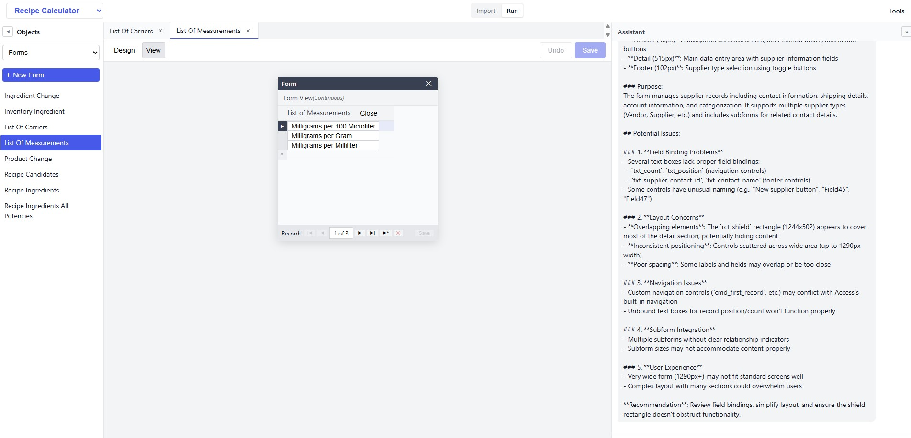

# AccessClone

**Convert Microsoft Access databases to modern web applications.**

[](LICENSE)
[](https://nodejs.org/)
[](https://www.postgresql.org/)

AccessClone imports your Access database — tables, queries, forms, reports, modules, and all — into a PostgreSQL-backed web application that looks and works like Access but runs in a browser.



## Why AccessClone?

Millions of business applications run on Microsoft Access. They work — but they're trapped on Windows desktops, limited to single users, and increasingly difficult to maintain. Rewriting from scratch means losing years of accumulated business logic.

Most migration tools try to translate code line by line — VBA to C#, Access SQL to T-SQL. That carries over every quirk and workaround from the original implementation. AccessClone takes a different approach: **copy the intent, not the code.**

Instead of translating VBA line by line, AccessClone extracts *what the code means to do* — "validate this field, save the record, show a confirmation" — and maps those intents to clean, idiomatic implementations on the new platform. The business logic survives. The Access-isms don't.

- **Tables & data** import with full fidelity — types, constraints, indexes, and rows
- **Queries** convert from Access SQL to PostgreSQL views and functions (regex engine + LLM fallback)
- **Forms** render in the browser with the same layout, controls, and record navigation
- **Reports** render with banded sections, grouping, and live data preview
- **Modules** (VBA) go through intent extraction — AI reads the code, identifies 30 known intent types (open form, validate field, save record, etc.), and maps them to deterministic templates. No line-by-line translation.
- **AI chat** analyzes each object, answers questions, and helps with conversion

## Features

### Full Import Pipeline
Import directly from `.accdb` / `.mdb` files — no manual schema translation required.
Tables, queries, forms, reports, and modules all import through the UI with one-click workflows.

### Access-Style Form Editor
- Design View with drag-and-drop controls (text boxes, combo boxes, buttons, subforms, and more)
- Form View with live data entry, record navigation, insert, update, and delete
- Continuous Forms, popup/modal forms, and tabbed subforms
- Property Sheet with Format / Data / Event / Other / All tabs — just like Access

### Banded Report Editor
- Five standard bands: Report Header/Footer, Page Header/Footer, Detail
- Dynamic group bands with configurable grouping, sorting, and intervals
- Live data preview with group-break detection
- Design View with resizable band sections

### Intent-Based VBA Migration
VBA modules aren't translated line by line. Instead, a three-stage pipeline preserves business logic cleanly:
1. **Extract** — AI reads VBA and produces structured intents (validate-required, open-form, save-record, confirm-action, etc.)
2. **Map** — Each intent is classified: mechanical (deterministic template), LLM-assisted (DLookup, RunSQL, loops), or gap (needs human review)
3. **Generate** — Mechanical intents produce code from templates. LLM-assisted intents get targeted AI generation. Gaps are flagged, not guessed at.

The result: clean, idiomatic code with clear traceability back to the original VBA.

### AI-Powered Chat Assistant
Every object has a built-in chat panel. The AI sees the full definition and data context:
- Auto-analyzes forms, reports, and modules on first open
- Search, analyze, and navigate records through natural language
- Query the dependency graph — "What tables does this form use?"
- Extract intents from VBA and generate wiring code interactively

### Multi-Database Support
Register and switch between multiple PostgreSQL databases from a single instance.
Each database is isolated in its own schema with independent tables, queries, forms, and reports.

### Dependency & Intent Graph
A unified graph tracks structural relationships (table → column → form → control) and business intent.
Understand how objects connect before making changes.

## Quick Start

### AI-Assisted Setup

The fastest way to get started is to give [INSTRUCTIONS.md](INSTRUCTIONS.md) to an AI assistant. It's written as a runbook for both humans and AI:

- **If you use Claude Code, Codex, Cursor, or Windsurf** — the AI can run every command for you. Just point it at the file and approve each step.
- **If you use ChatGPT, Claude on the web, or similar** — paste the file into the chat. The AI will walk you through each command, and you paste the output back for it to check.

### Manual Setup

#### Prerequisites

**To run the application:**
- Node.js 18+
- PostgreSQL 14+
- PowerShell 5.1+
- Windows with MS Access installed (for importing — the running app is cross-platform)

**Additionally, for UI development:**
- Java 11+ (required by shadow-cljs to compile ClojureScript)

#### 1. Install Dependencies

Run PowerShell as Administrator:

```powershell
.\install.ps1
```

#### 2. Set Up a Database

```powershell
.\setup.ps1 -DatabaseName northwind -Password <your_pg_password>
```

#### 3. Start the Application

```powershell
.\start.ps1 -Password <your_pg_password>
```

Open **http://localhost:3001** in your browser.

For UI development with hot reload:

```powershell
.\start.ps1 -Password <your_pg_password> -Dev
```

#### 4. Import an Access Database

1. Click **Import** in the sidebar
2. Browse to your `.accdb` or `.mdb` file
3. Select objects to import (tables, queries, forms, reports, modules)
4. Click Import — AccessClone handles the rest

## Architecture

```
Access DB (.accdb)  →  Export (PowerShell/COM)  →  Convert (Access SQL → PostgreSQL)
                                                          ↓
         Browser UI (ClojureScript)  ←  Express API  ←  PostgreSQL
                    ↓
            AI Chat Assistant (per-object context, tools, auto-analyze)
```

### Project Structure

```
accessclone/
├── server/                 # Node.js/Express backend
│   ├── routes/             #   REST API endpoints
│   ├── graph/              #   Dependency/intent graph engine
│   ├── lib/                #   Shared utilities (events, schema cache)
│   └── infrastructure.sql  #   Database bootstrap script
├── ui/                     # ClojureScript/Reagent frontend
│   └── src/app/
│       ├── state.cljs      #   Core state management
│       ├── state_form.cljs #   Form editor state
│       ├── state_report.cljs # Report editor state
│       └── views/          #   UI components
├── skills/                 # Conversion guides and patterns
├── install.ps1             # Dependency installer
├── setup.ps1               # Database setup
└── start.ps1               # Application launcher
```

**Frontend**: ClojureScript with Reagent (React wrapper). Single-page app with tabbed interface, drag-and-drop editors, and real-time chat.

**Backend**: Node.js/Express serving a REST API. Schema-per-database isolation. LLM integration for chat and code analysis.

**Database**: PostgreSQL with `shared` schema for metadata (forms, reports, modules, events, graph) and per-database schemas for imported data.

## API Overview

| Area | Endpoints | Description |
|------|-----------|-------------|
| Data | `/api/data/:table` | CRUD operations on table records |
| Tables | `/api/tables` | Table metadata with column details |
| Queries | `/api/queries`, `/api/queries/run` | View listing and SQL execution |
| Functions | `/api/functions` | PostgreSQL function catalog |
| Forms | `/api/forms/:name` | Form definition CRUD |
| Reports | `/api/reports/:name` | Report definition CRUD |
| Modules | `/api/modules/:name` | Module source code |
| Import | `/api/access-import/*` | Access database import pipeline |
| Chat | `/api/chat` | LLM chat with object context |
| Graph | `/api/graph/*` | Dependency and intent queries |
| Lint | `/api/lint/*` | Cross-object validation |

## Converting an Access Database

See the [conversion guide](skills/conversion.md) for the complete workflow:

1. **Setup** — Create database and configure connection
2. **Tables** — Import table structures, data, and indexes
3. **Forms & Reports** — Import definitions with layout, controls, and data bindings
4. **Queries** — Convert Access SQL to PostgreSQL views and functions
5. **Modules** — Extract intents from VBA, map to deterministic templates, generate clean code

## Configuration

Database connection via environment variables:

```powershell
$env:PGHOST = "localhost"
$env:PGPORT = "5432"
$env:PGUSER = "postgres"
$env:PGPASSWORD = "your_password"
$env:PGDATABASE = "your_database"
```

Or use `DATABASE_URL` for a full connection string.

LLM chat requires an `ANTHROPIC_API_KEY` environment variable.

## Testing

After any change, run from the project root:

```
npm test
```

This runs all unit tests (406 tests across 12 test suites).

If you changed database/schema routing code, also run:

```
npm run test:db
```

DB tests require a running PostgreSQL instance and are gated behind an environment variable — they won't run accidentally.

## Documentation

| Doc | Audience | Purpose |
|-----|----------|---------|
| [PRODUCT.md](PRODUCT.md) | Stakeholders, AI agent developers | Full product description — pipeline, transforms, AI automation thesis |
| [INSTRUCTIONS.md](INSTRUCTIONS.md) | New users, AI assistants | Step-by-step install and setup runbook |
| [ARCHITECTURE.md](ARCHITECTURE.md) | Developers | Technical deep dive — state management, routing, design decisions |
| [Codebase Guide](skills/codebase-guide.md) | LLMs, new contributors | Pipeline-oriented walkthrough of every subsystem |
| [Testing Guide](skills/testing.md) | LLMs, developers | Test map, patterns, coverage gaps, when to run what |
| [Conversion Guide](skills/conversion.md) | Users importing Access DBs | Full import workflow |
| [CLAUDE.md](CLAUDE.md) | AI assistants developing the code | Implementation details, conventions, debugging notes |

## Contributing

Contributions are welcome! Please see the [issue templates](.github/ISSUE_TEMPLATE/) for bug reports and feature requests.

## License

[MIT](LICENSE) — Kenneth Tyler, 2026

---

## Appendix: Beyond the Browser — AccessClone as an AI Agent Substrate

The web application described above is one way to use AccessClone's output. There is another.

### The observation

Millions of Access databases encode real business processes — order fulfillment, inventory tracking, customer management, compliance workflows. These processes are currently operated by humans clicking through forms. But the business logic isn't in the clicking. It's in the structure: which fields get validated, what data gets looked up, which forms chain together, what conditions trigger what actions.

AccessClone already extracts all of this into machine-readable form:

| What AccessClone produces | What it represents |
|---|---|
| **30 typed intents** (validate-required, open-form-filtered, save-record, dlookup, confirm-action, ...) | The action space — every operation the business process performs |
| **Dependency graph** (table → column → form → control → intent) | The reasoning substrate — how objects connect and why |
| **Form definitions as JSON** | Workflow descriptions — inputs, outputs, validation rules, navigation logic |
| **Queries as PostgreSQL views** | Data access patterns — declarative, composable, standard SQL |

This isn't a web app. It's a structured operational specification of a business process.

### The integration

[OpenClaw](https://openclaw.ai/) is an open-source autonomous AI agent runtime — a long-running service that connects AI models to messaging platforms and gives them the ability to act. It has a modular skill system, runs locally, and is model-agnostic.

An OpenClaw skill backed by AccessClone's structured output could operate a business process autonomously:

```
Access DB (opaque binary)
    → AccessClone (extraction)
        → Structured intents + dependency graph + PG views
            → OpenClaw skill (execution)
                → AI agent operates the business process
```

The agent doesn't need to "figure out" what a form does. It reads the intent graph: `validate-required(field: "CustomerID")` → `save-record` → `show-message("Order saved")`. Each intent maps to a concrete action the agent can execute against the database. The dependency graph tells it what data feeds what process. The form definitions tell it what a human would see — which the agent can describe, summarize, or present through any channel (Slack, WhatsApp, email, API).

### The implication

The bottleneck for automating white-collar work isn't AI capability — it's having structured representations of specific business processes. Access databases *are* structured representations of business processes, but they're trapped in a proprietary format no AI can reason over.

AccessClone is the extraction layer. The browser UI is a development and debugging tool. The real output is machine-operable business logic — ready for an autonomous agent to run.
